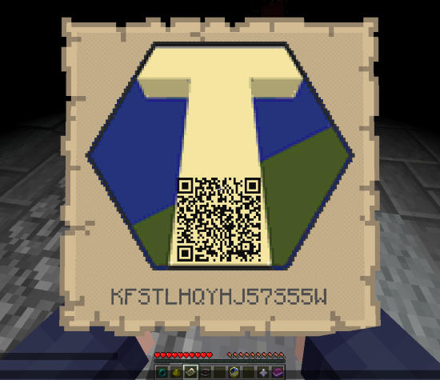
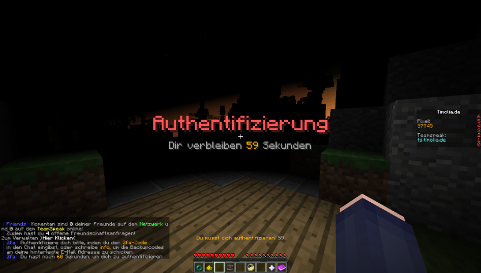
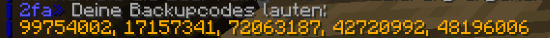

Two-Factor Authentication helps you secure your account – nobody wants third parties 
to abuse their account after gaining access through phishing, hacking, or similar methods.

## Why 2FA makes sense for *you*
Time and again, we hear in the [Help Channel](/general/faq/#who-supports-me-if-i-have-questions) that a Minecraft account has been hacked and is now being used by strangers to cheat on public servers. Of course, you can (and should!) take **security measures**, such as [changing your password regularly](https://www.minecraft.net/en-us/profile) and setting [security questions](https://account.mojang.com/me/settings) on Mojang; however, there is a reason why many parts of the internet now offer an additional security layer: 
**Two-Factor Authentication**.

Whether it's Twitter, Discord, or Steam, it is possible to set up two-step verification everywhere. 
Put simply, **2FA means for you that a hacker cannot use your account on Timolia even if they have access to your password**.

## How does the system work?
You simply **link** your **Minecraft account** on Timolia with a **2FA app** on your phone. 
Once this is done, Timolia will ask you for the constantly changing code displayed on your phone to confirm that you are really you. 
But don't worry: you don't always have to have your phone ready just because you restarted the game. 
You only need to re-verify if you haven't been online for more than **24 hours** or if your **IP has changed**! 
Additionally, you have the option to force a re-identification with `/2fa logout` if you leave your PC and cannot trust other people present.

## What do I need to keep in mind?
After setting up Two-Factor Authentication, backup codes will be displayed. **Note these down in a safe place**! 
If you lose access to your phone through loss, theft, or similar, **you will lose access to this Minecraft account on Timolia without these codes**. 
In this case, we **cannot** deactivate Two-Factor Authentication for you!

---

## Setting up 2FA
- Read through [What do I need to keep in mind?](#what-do-i-need-to-keep-in-mind) carefully and make sure you have understood the section. If you have questions, contact [Support](/faq/#who-supports-me-if-i-have-questions)!
- **Install** an **Authenticator app** on your phone. We recommend **Aegis** ([Android](https://play.google.com/store/apps/details?id=com.beemdevelopment.aegis)). Alternatively, you can use **Google Authenticator** ([Android](https://play.google.com/store/apps/details?id=com.google.android.apps.authenticator2) / [iOS](https://itunes.apple.com/de/app/google-authenticator/id388497605)). You can also find these apps by searching the App Store or Play Store. Naturally, you can use any other authentication app.
- Use `/2fa setup` to display the QR code and the secret you can use to link your account. 
  Never share both pieces of data with third parties and **ensure that no one can see them**, neither at the time of setup nor at any time thereafter!
   
  
- Now open your authentication app and click the symbol to add a new account. 
  Depending on whether your phone has a functioning camera, you can simply scan the **QR code** on your screen or type the **secret** below it into your phone.
- If the **link** was successful, you should now see a six-digit **code displayed** on your phone that is valid for 30 seconds and then regenerated. 
  Enter the code into your Minecraft chat window now to confirm the link. 
  Don't worry, the message will not be written in the public chat.
- Done! You can now continue playing normally. Your account, your stats, and your ranks are secure.
   
  
- **Attention!** Please note down the **backup codes** (viewable under `/2fa buc`)! You must use these codes if you lose your phone or can no longer access your app for other reasons. 
  **Without backup codes, you can no longer access your account!**
   
  

## What else you can do
Make sure you use different passwords for your Minecraft account, your email account, and all other services where you are registered. This way, an attacker never gains access to all your accounts simultaneously, and you can change passwords very easily.

It is recommended to use a password manager, e.g., [Bitwarden](https://bitwarden.com/).

:::tip
All commands for the 2FA system can be found [here](../commands#two-factor-authentication).
:::
