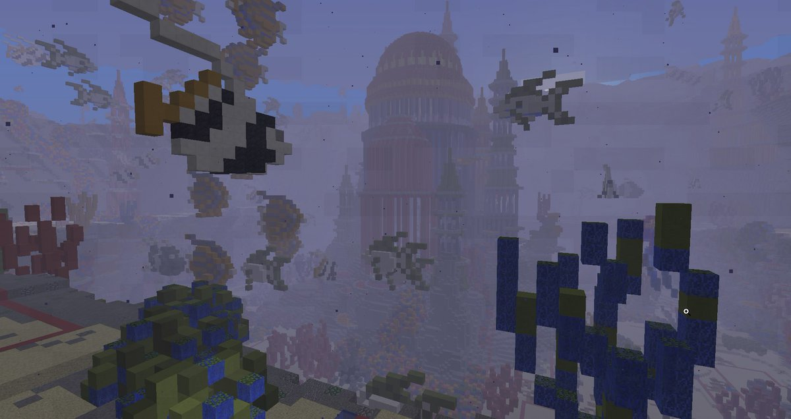

# Allgemeines
Dies ist eine Übersicht über alle Baugebiete, die du auf dem Citybuild Server erkunden kannst.
Du findest eine kurze Beschreibung über das jeweilige Baugebiet und die dazugehörigen Regeln.

## 1 - Weststadt

Die Weststadt ist ein stetig wachsendes Baugebiet mit vielen kleinen Häusern. Sie bildet die Vorstadt zu Downtown. Hier bekommst du dein Startgrundstück,
welches in einem Vorstadt-Baustil bebaut werden sollte. Große viereckige Dirt oder Cobblestonewände, sowie 1x1 Türme (außer innerhalb der Bauzeit) sind nicht erwünscht und müssen abgerissen werden.
Die Grundstücke sind 20×20 Blöcke groß und sind kostenlos.
Du darfst auf deinem GS maximal 10 Haustiere haben.

### Baugebietsregeln, Informationen und Verantwortliche
- Grundstücke sind **20*20** (20 hoch, 10 tief) Blöcke groß
- **Kostenloses** Grundstück
- Pro Spieler nur **ein** Grundstück
- **10 Tiere und 10 Entities** pro GS erlaubt. Sollte ein Tier oder Entity außerhalb des Grundstückes sein, wird dieses **nicht** erstattet (z.B. durch Serverneustart)
- **Vorstadtbaustil**
- **kein** Ownerwechsel möglich

| Verantwortliche | Funktion |
| ------ | -------- |
| Twilex | Hauptverantwortlich |

## 2 - Upperhills

Die Upper Hills liegen neben den Summerfields und bilden das Baugebiet für die Pro’s und Experts Timolias. Jene können sich hier ein günstiges und vorallem relativ großes Grundstück kaufen.
Die Grundstücke sind 50×50 Blöcke groß und kosten für Pro’s und Experts 2500 Timolions.
Es ist nur ein Grundstück pro Spieler erlaubt.
Das Baugebiet wird auch oft als “Villengebiet” gesehen. Wenn du dich hier niederlassen möchtest,
ist es daher notwendig, eine Villa zu bauen. Hochhäuser sind nicht erwünscht und müssen wieder abgerissen werden. 1x1 Türme sind nur zum Bau des
Hauses gestattet und müssen dann wieder abgerissen werden.
Farmen sollten stets im Keller errichtet werden, die Gärten müssen immer gepflegt werden, Rasen mähen und Hecken schneiden nicht vergessen!
Pro Grundstück sind 25 Tiere und 25 Entities erlaubt. Die Grundstücksgröße muss
eingehalten werden, es werden keine Blöcke außerhalb des Grundstückes gesetzt.

### Baugebietsregeln, Informationen und Verantwortliche
- **Nach dem** Umbau sollte das GS **natürlich** aussehen
- Grundstücke sind **50*50** Blöcke groß
- Ein Grundstück kostet **2500T**
- Es sollten **Villen** und ähnliches gebaut werden
- Grundstücke sind ausschließlich für PRO+
- Pro Spieler nur **ein** Grundstück
- Maximal **25 Tiere** und **25 Entities** pro GS. Sollte ein Tier oder Entity außerhalb des Grundstückes sein, wird dieses **nicht** erstattet (z.B. durch Serverneustart)
- Ownerwechsel möglich (5000T)

| Verantwortliche | Funktion |
| ------ | -------- |
| Saporital | Hauptverantwortlich |

## 3 - Downtown

Downtown bildet den Spawn von Timolia und stellt alle wichtigen, großen Gebäude zur Verfügung. Rund um den Marktplatz, die Polizei und die Kirche.
Die Grundstücke kosten zwischen 20.000T und 145.000T und sollten möglichst Urban wirken (Hohe, große Häuser; keine großen Gärten).
In Downtown sind bis zu 50 Haustiere auf dem Grundstück erlaubt.

### Baugebietsregeln, Informationen und Verantwortliche
- Kosten zwischen 20.000T und 145.000T pro Grundstück
- Baustil: möglichst Urban (Hohe, große Häuser; keine großen Gärten)

| Verantwortliche | Funktion |
| ------ | -------- |
| Saporital | Hauptverantwortlich |

## 4 - Summerfields

Die Summerfields sind ein idyllisch, ländliches Baugebiet in welchem Ackerbau, Forstwirtschaft und Viehzucht vorherrschen. Das Hauptaugenmerk liegt bei weiten goldenen Feldern, saftigen Wiesen und urigen Wäldern und überall verstreut die rustikalen Höfe.
Direkt um den Spawn herum befinden sich kleinere Grundstücke, auf welchem kleinere ländliche  Häuser gebaut werden sollen, welche den Dorfkern Summerfields bilden.
Je weiter man sich vom Spawn entfernt, desto größer und verstreuter werden die Grundstücke für ein optimales ländliches Feeling.

### Baugebietsregeln, Informationen und Verantwortliche
- Grundstücke sind in verschiedenen Größen zu haben.
- Baustil: rustikale Dorfhäuser um den Spawn und Bauernhöfe mit Feldern/Weiden
- automatische Farmen unterirdisch bauen
- pro User sind **drei** Grundstücke erlaubt
- es sind insgesamt 75 Tiere und Entities pro GS erlaubt. Sollte ein Tier oder Entity außerhalb des Grundstückes sein, wird dieses **nicht** erstattet (z.B. durch Serverneustart)
- die Häuser sollten nicht mehr als 40 Blöcke in die Höhe ragen.

| Verantwortliche | Funktion |
| ------ | -------- |
| Caprea | Hauptverantwortlich |

## 5 - Ägypten

Ägypten, das sandige Gebiet mit seinem atemberaubenden Fluss und den hohen Sanddünen, zeigt die Vielfalt der Natur, die in Ägypten steckt.
In den gigantischen Pyramiden lauern Gefahren und wertvolle Schätze. In der geheimen Bibliothek lauert eine mysteriöse magische Kraft, die der ganzen Atmosphäre Leben einhaucht.
Erforsche sie und entdecke alle tollen Sachen von Ägypten und finde alle Geheimnisse, die sich in der Wüste verbergen.

### Baugebietsregeln, Informationen und Verantwortliche
- Nur **1 GS** pro User
- Maximal sind **10 Tiere** und **25 Entities** pro Grundstück erlaubt
- **Ägyptischer Baustil**, keine modernen Sandsteinhäuser mit großen Glasfenstern, keine Pyramiden
- Die Grundstücke sind 20x20, 20x25, 25x25, 25x30 und 30x30 groß
- Die Grundstücke kosten 5000T, 5500T, 6000T, 6500T und 7000T. Der Preis richtet sich nach der Größe des Grundstückes.

| Verantwortliche | Funktion |
| ------ | -------- |
| Caprea| Hauptverantwortlich |

## 6 - Atlantis

Unter dem Meer... in den endlosen Tiefen liegt ein mystisches, verborgenes Reich - Atlantis! Tauche hinein und erlebe fantastische Abenteuer zwischen Korallen, schwimme mit Fischen,
bau dir ein kleines Reich inmitten der Ruinen von Atlantis.

### Baugebietsregeln, Informationen und Verantwortliche
- es gibt zwei Grundstücksgrößen
- Bauhöhe beträgt stets 20 Blöcke
- Grundstücke auf dem Vorsprung (Klippen) haben eine Bautiefe von 20 Blöcken, Grundstücke auf festem Untergrund gehen 30 Blöcke in die Tiefe
- Der Baustil sollte der Umgebung angepasst werden
- es sind 10 Entities erlaubt (keine Tiere). Sollte ein Tier oder Entity außerhalb des Grundstückes sein, wird dieses **nicht** erstattet (z.B. durch Serverneustart)
- pro User sind zwei Grundstücke erlaubt

| Verantwortliche | Funktion |
| ------ | -------- |
| Saporital | Hauptverantwortlich |

## 7 - Frozen City

Frozen City ist ein Baugebiet, das in einem Ice Spikes Biom liegt. In Frozen City soll man passend zum Ice Spikes Biom bauen, sodass die Umgebung mit dem Grundstück harmoniert.
Grundstücke müssen neu gebaut werden, wenn diese Voraussetzung nicht eingehalten wird.
Die Größe der Grundstücke ist unterschiedlich. Jeder Spieler darf nur 1 Grundstück in Frozen City besitzen.

### Baugebietsregeln, Informationen und Verantwortliche/r
- **Ein Grundstück** pro Spieler
- Baustil im Rahmen Ice-Spikes einhalten
- Maximal 10 Tiere pro Grundstück. Sollte ein Tier oder Entity außerhalb des Grundstückes sein, wird dieses **nicht** erstattet (z.B. durch Serverneustart)
- Tiefe: Bis Bedrock
- Höhe: 30 Blöcke über den Boden

| Verantwortliche | Funktion |
| ------ | -------- |
| LaShadow | Hauptverantwortlich |

## 8 - Wellington

In Wellington lassen sich diejenigen User nieder, die schön ruhig in der schönen Landschaft wohnen wollen. Zwischen den Bäumen, neben Flüssen und neben dem Meer kannst du
dir ein großes, aber günstiges Grundstück kaufen und dich dort niederlassen und ein schönes ländliches Fachwerkhaus bauen.

### Baugebietsregeln, Informationen und Verantwortliche
- Bitte baue der Landschaft angepasst
- Der Baustil sollte ländlich sein
- Nach 3 Monaten Inaktivität wird das Grunstück resettet
- Die Kaufschilder befinden sich direkt an den Grunstücken
- Jeder User darf 2 Grunstücke besitzen
- Maximal sind 25 Entities und 10 Tiere pro Grundstück erlaubt. Sollte ein Tier oder Entity außerhalb des Grundstückes sein, wird dieses **nicht** erstattet (z.B. durch Serverneustart)

| Verantwortliche | Funktion |
| ------ | -------- |
| Twilex| Hauptverantwortlich |