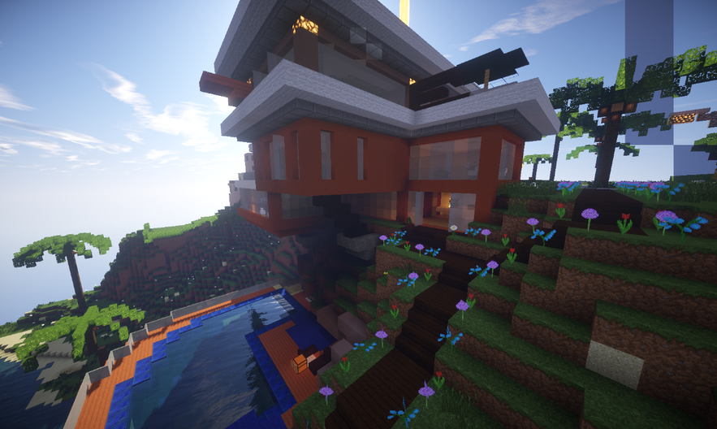
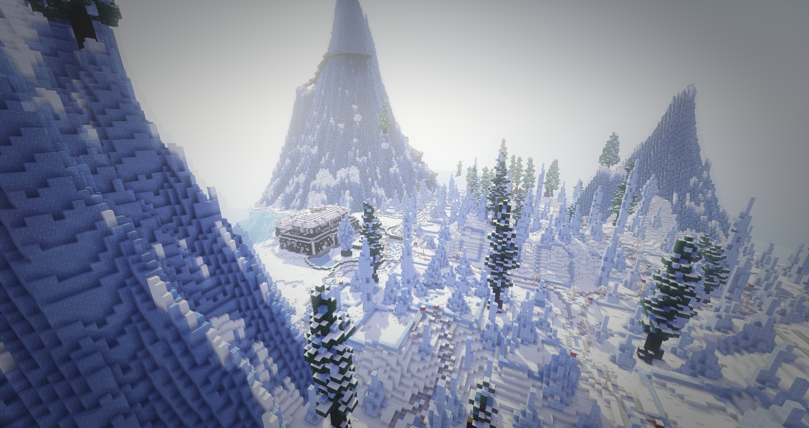
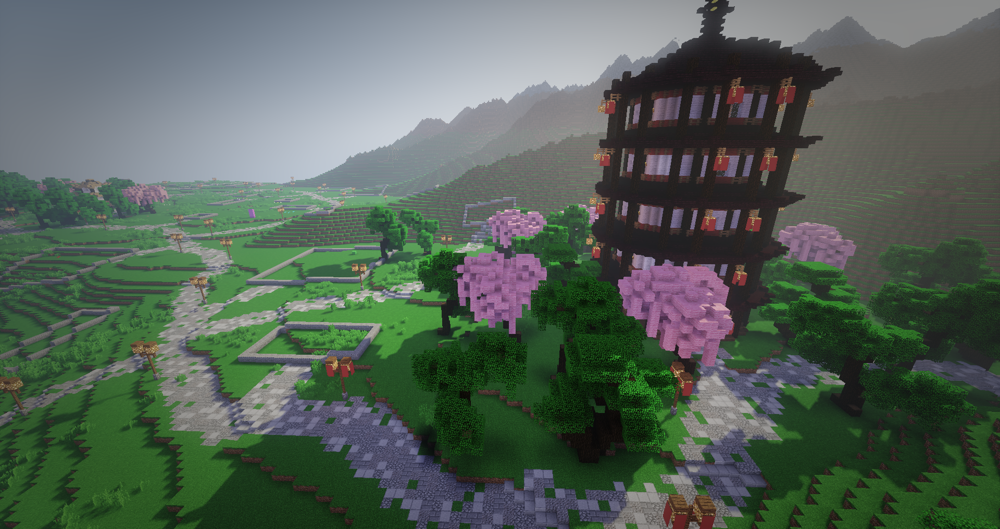
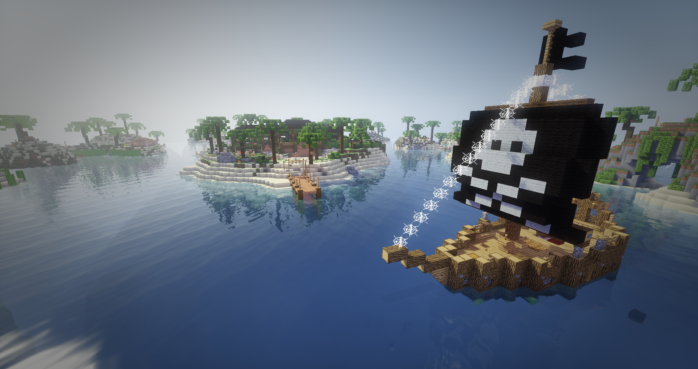
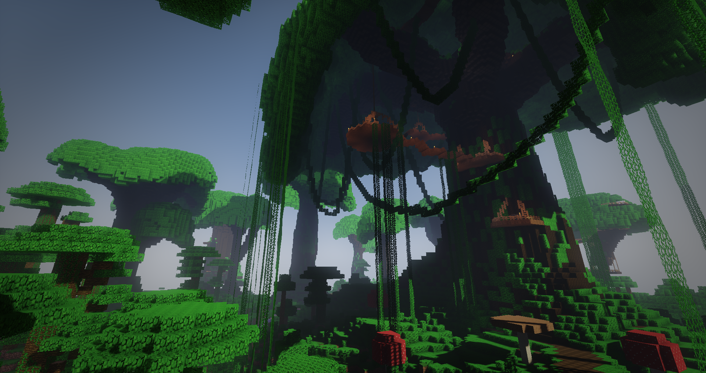
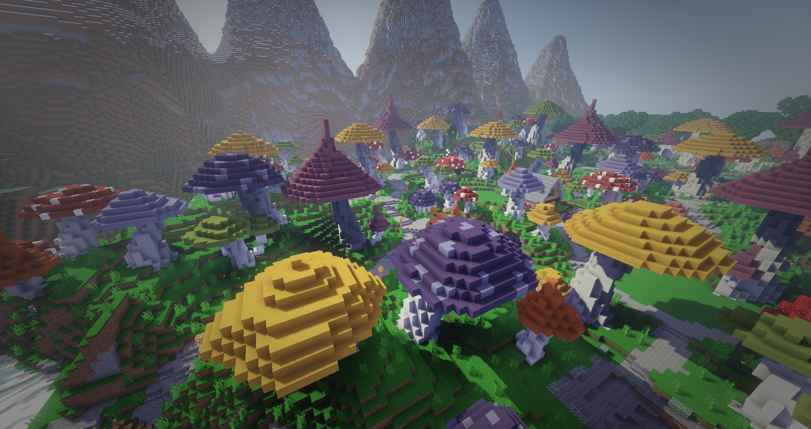

# Allgemeines
Dies ist eine Übersicht über alle Baugebiete, die du auf dem Citybuild Server erkunden kannst.
Du findest eine kurze Beschreibung über das jeweilige Baugebiet und die dazugehörigen Regeln.

## 1 - Weststadt

Die Weststadt ist ein stetig wachsendes Baugebiet mit vielen kleinen Häusern. Sie bildet die Vorstadt zu Downtown, hier bekommst du dein Startgrundstück,
welches in einem Vorstadt-Baustil bebaut werden sollte. Große viereckige Dirt oder Cobblestonewände, sowie 1x1 Türme (außer innerhalb der Bauzeit) sind nicht erwünscht und müssen abgerissen werden.
Die Grundstücke sind 20×20 Blöcke groß und sind kostenlos.
Du darfst auf deinem GS maximal 10 Haustiere haben.

### Baugebietsregeln, Informationen und Verantwortliche
- Grundstücke sind <strong>20*20</strong> (20 hoch, 10 tief) Blöcke groß
- <strong>Kostenloses</strong> Grundstück
- Pro Spieler nur <strong>ein</strong> Grundstück
- Angebunden an das Bahnnetz
- <strong>10 Tiere und 10 Entities</strong> pro GS erlaubt
- <strong>Vorstadtbaustil</strong>
- <strong>kein</strong> Ownerwechsel möglich

| Verantwortliche | Funktion |
| ------ | -------- |
| JOlegna | Hauptverantwortlich |
| Caprea | Nebenverantwortlich |
| Digimon | Nebenverantwortlich |
| HoleOne| Nebenverantwortlich |
| kd9b | Nebenverantwortlich |
| Twilex | Nebenverantwortlich |

## 2 - Upperhills

Die Upper Hills liegen neben den Summerfields und bilden das Baugebiet für die Pro’s und Experts Timolias. Jene können sich hier ein günstiges und vorallem relativ großes Grundstück kaufen.
Die Grundstücke sind 50×50 Blöcke groß und kosten für Pro’s und Experts 2500 Timolions.
Es ist nur ein Grundstück pro Spieler erlaubt.
Das Baugebiet wird auch oft als “Villengebiet” gesehen. Wenn du dich hier niederlassen möchtest,
ist es daher notwendig eine Villa zu bauen. Hochhäuser sind nicht erwünscht und müssen wieder abgerissen werden. 1x1 Türme sind nur zum Bau des
Hauses gestattet und müssen dann wieder abgerissen werden.
Farmen sollten stets im Keller errichtet werden, die Gärten müssen immer gepflegt werden, Rasen mähen und Hecken schneiden nicht vergessen!
Pro Grundstück sind 25 Tiere und 25 Entities erlaubt. Die Grundstücksgröße muss
eingehalten werden, es werden keine Blöcke außerhalb des Grundstückes gesetzt.

### Baugebietsregeln, Informationen und Verantwortliche
- <strong>Nach dem</strong> Umbau sollte das GS <strong>natürlich</strong> aussehen
- Grundstücke sind <strong>50*50</strong> Blöcke groß
- <strong>2500T</strong> kostet ein Grundstück
- Es sollten <strong>Villen</strong> und ähnliches gebaut werden
- Grundstücke sind ausschließlich für PRO+
- Pro Spieler nur <strong>ein</strong> Grundstück
- Angebunden an das <strong>Bahnnetz</strong>
- maximal <strong>25 Tiere</strong> und <strong>25 Entities</strong> pro GS
- Ownerwechsel möglich (5000T)

| Verantwortliche | Funktion |
| ------ | -------- |
| JOlegna | Hauptverantwortlich |
| HoleOne| Nebenverantwortlich |
| kd9b | Nebenverantwortlich |

## 3 - Downtown

Downtown bildet den Spawn von Timolia und stellt alle wichtigen, großen Gebäude zur Verfügung. Rund um den Marktplatz findest du die Bahngleise, die Polizei und
die Kirche.
Die Grundstücke kosten zwischen 20.000T und 145.000T und sollten möglichst Urban wirken (Hohe, große Häuser; keine großen Gärten).
In Downtown sind bis zu 50 Haustiere auf dem Grundstück erlaubt.

### Baugebietsregeln, Informationen und Verantwortliche
- Kosten zwischen 20.000T und 145.000T pro Grundstück
- Baustil: möglichst Urban (Hohe, große Häuser; keine großen Gärten)

| Verantwortliche | Funktion |
| ------ | -------- |
| saporital | Hauptverantwortlich |
| JOlegna| Nebenverantwortlich |

## 4 - Summerfields

Die Summerfields sind ein idyllisch, ländliches Baugebiet in welchem Ackerbau, Forstwirtschaft und Viehzucht vorherrschen. Das Hauptaugenmerk liegt bei weiten goldenen Feldern, saftigen Wiesen und urigen Wäldern und überall verstreut die rustikalen Höfe.
Direkt um den Spawn herum befinden sich kleinere Grundstücke, auf welchem kleinere ländliche  Häuser gebaut werden sollen, welche den Dorfkern Summerfields bilden.
Je weiter man sich vom Spawn entfernt, desto größer und verstreuter werden die Grundstücke für ein optimales ländliches Feeling.

### Baugebietsregeln, Informationen und Verantwortliche
- Grundstücke sind in verschiedenen Größen zu haben.
- Baustil: rustikale Dorfhäuser um den Spawn und Bauernhöfe mit Feldern/Weiden
- automatische Farmen unterirdisch bauen
- pro User sind <strong>zwei</strong> Grundstücke erlaubt
- es sind insgesamt 75 Tiere und Entities pro GS erlaubt
- die Häuser sollten nicht mehr als 40 Blöcke in die Höhe ragen.
- angebunden an das Bahnnetz

| Verantwortliche | Funktion |
| ------ | -------- |
| Caprea | Hauptverantwortlich |

## 5 - Ägypten

Ägypten, das sandige Gebiet mit seinen atemberaubenden Fluss und den hohen Sanddünen zeigt die Vielfalt der Natur die in Ägypten steckt.
In den gigantischen Pyramiden lauern Gefahren und wertvolle Schätze. In der geheimen Bibliothek lauert eine mysteriöse magische Kraft, die der ganzen Atmossphäre Leben einhaucht.
Erforsche sie und entdecke alle tollen Sachen von Ägypten und finde alle Geheimnisse die sich in der Wüste verbergen.

### Baugebietsregeln, Informationen und Verantwortliche
- Nur <strong>1 Gs</strong> pro User
- Maximal sind <strong>10 Tiere</strong> und <strong>25 Entities</strong> pro Grundstück erlaubt
- <strong>Ägyptischer Baustil</strong>, keine modernen Sandsteinhäuser mit großen Glasfenstern, keine Pyramiden
- Die Grundstücke sind 20x20, 20x25, 25x25, 25x30 und 30x30 groß
- Die Gsrundstücke kosten 5000T, 5500T, 6000T, 6500T und 7000T. Der Preis richtet sich nach der Größe des Grundstückes
- Ägypten hat eine Bahnanbindung

| Verantwortliche | Funktion |
| ------ | -------- |
| Twilex | Hauptverantwortlich |
| JoJoYoshy| Nebenverantwortlich |
| Caprea| Nebenverantwortlich |

## 6 - Flussufer

Das erhabene Baugebiet Flussufer grenzt genau an das bäuerlich - einfachen Summerfields, besticht jedoch durch seine vielen anmutenden Flüsschen  und vorallen den prachtvollen Bauten.
Dies ist kein Baugebiet für das einfache Volk, wer hier ein Anwesen sein Eigen nennt, hat es wahrlich geschafft.
Gebaut werden Landvillen, herrschaftliche Landsitze und Herrenhäuser mit Barock- oder englischen Gärten (keine Felder). Die Grundstücke sind groß und sehr, sehr teuer.

### Baugebietsregeln, Informationen und Verantwortliche
- Grundstücke sind in verschiedenen Größen zu haben
- Baustil rutikal und reich –  edle Herrenhäuser, adelige Landsitze, alte Villen, Schnörkel und Protz
- 1 Grundstück pro User
- automatische Farmen unterirdisch bauen
- angebunden an das Bahnnetz

| Verantwortliche | Funktion |
| ------ | -------- |
| Caprea | Hauptverantwortlich |

## 7 - Ice Spikes

Frozen City ist ein Baugebiet was in einem Ice Spike Biom liegt. In Frozen City soll man passend zum Ice Spikes Biom bauen, so dass die Umgebung mit dem Grundstück harmoniert.
Grundstücke müssen Neugebaut werden, wenn die oben genannte Voraussetzung nicht eingehalten werden.
Die Größe der Grundstücke sind unterschiedlich. Jeder Spieler darf nur 1 Grundstück in Frozen City besitzen.

### Baugebietsregeln, Informationen und Verantwortliche/r
- <strong>Ein Grundstück</strong> pro Spieler
- Baustil im Rahmen Ice-Spikes einhalten
- Maximal 10 Tiere pro Grundstück
- Tiefe: Bis Bedrock
- Höhe: 30 Blöcke über den Boden

| Verantwortliche | Funktion |
| ------ | -------- |
| LaShadow | Hauptverantwortlich |

## 8 - Japan

Die großen Berge, schöne japanische Bäume, Tempel von großen Kaisern sind im schönen, prachtvollen Baugebiet Japan zu finden.
An kleinen Schreinen kann man in sich gehen und seinen Geist erforschen. In der tollen Landschaft kannst du dich bei den großartigen
Bäumen von Japan entspannen. Im Tal, wo eher die Bauern leben, gibt es große Reisfelder womit das Gebiet versorgt wird.
Oben auf den Bergen ließen sich die reicheren Leute nieder und haben prachtvolle Tempel aufgebaut.

### Baugebietsregeln, Informationen und Verantwortliche
- Grundstücke sind in verschiedenen Größen zu haben
- Der Grundstückspreis steigt mit der Größe des Grundstücks
- Die Grundstücke sollen im Asiatischen Stil erbaut werden, zudem sollen auf den Bergen eher "edlere" Gebäude stehen, als im Tal
- Es dürfen keine normalen Bäume gepflanzt werden. Die Tierbegrenzung pro Grundstück liegt hier bei 50
- Zudem darf man in Japan maximal 2 Grundstücke besitzen, z.B Eins oben, Eins unten
- Der Preis auf den Bergen liegt bei 25 Timolions pro Block. Der Preis im Tal liegt bei 15 Timolions.
- Maximal sind 25 Entities und 10 Tiere pro Grundstück erlaubt

| Verantwortliche | Funktion |
| ------ | -------- |
| Twilex | Hauptverantwortlich |

## 9 - Karibik

Die Karibik ist eine Region im Süd-Westlichen Teil von Timolia, sie besteht wie der Name schon sagt aus Karibischen Inseln.
Es gibt viel Gesindel in der Welt von Timolia doch nur die Reichen und Schönen können es sich leisten davon Abstand zu gewinnen und eine Grundstück in der Karibik zu besitzen.
Es gibt kein besseres Baugebiet um der Welt zu zeigen wie Reich sie sind und was für einen Status sie besitzen, welche Frau oder Mann könnte ihnen denn dann noch widerstehen?
Tropische Temperaturen, Sonnenschein und das Rauschen des Meeres sind nur einige Gründe die für dieses Baugebiet sprechen.
Genießen Sie es in Ihrer erbauten Finca zu leben, erweitern Sie ihre Insel oder gehen sie doch eine runde tauchen im klarsten Gewässer ganz Timolias.
Es gibt viel zu entdecken rund um die Inseln welche stetig erweitert und aufregender gestaltet werden.
Am Spawn der Karibik befindet sich für Ihre vollkommene Zufriedenheit Gästezimmer, eine Bar und sogar ein Restaurant spezialisiert auf Meereszutaten aus der Region.
Ihr könnt euch auch Grundstücke auf dem Meer kaufen. Hier sollten dann Boote in der Karibik oder eher ältere Schiffe gebaut werden und keine modernen Yachten/Speedboote.
Jeder User darf auch nur ein Boot besitzen. Es sind keine Farmen auf den Booten erlaubt.

### Baugebietsregeln, Informationen und Verantwortliche
- <strong>Nach dem</strong> Umbau sollte die Insel noch <strong>natürlich</strong> aussehen
- Passend zur Karibik bauen, eher aus natürlichem Material
- Pro Spieler nur <strong>ein</strong> Grundstück
- maximal <strong>10 Tiere</strong> und <strong>25 Entities</strong> pro GS
- Ownerwechsel möglich (5000T)

| Verantwortliche | Funktion |
| ------ | -------- |
| JOlegna | Hauptverantwortlich |
| JoJoYoshy | Nebenverantwortlich |
| kd9b | Nebenverantwortlich |

## 10 - Mammutwald

Wenn ihr gerne Baumhäuser baut und eines der extragroßen Art haben möchtet, ist der Mammutwald das richtige für euch. 
Ob ihr nun in der riesigen Wurzel, oben in der Baumkrone oder auf den Blättern leben möchtet, es ist für jeden Baumfreund etwas dabei.
Es sind keine Farmen oder ähnliches erwünscht. Grundstücke sind Bäume und dürfen nicht entfernt, maximal ausgehöhlt und leicht verändert werden.
Es sind Baumhäuser zu bauen. Grundstücke kosten zwischen 76.000T und 121.000T und sind im Hauptbaum zu kaufen. Man darf dort bis zu 25 Tiere haben.

### Baugebietsregeln, Informationen und Verantwortliche
- keine Farmen oder ähnliches erwünscht
- Bäume dürfen nicht entfernt werden
- Kosten zwischen 76.000T und 121.000T

| Verantwortliche | Funktion |
| ------ | -------- |
| saporital | Hauptverantwortlich |

## 11 - Minedig

Venedig ist wie im Real Life am Wasser gelegen und es sind viele kleine Inseln auf denen man Grundstücke kaufen kann. Man baut kleine Häuser direkt aneinandergereiht mit
fröhlicheren Materialien wie z.B Quartz oder buntem Lehm. In Venedig sind die Grundstücke ähnlich klein wie im Mittelalter, maximal 15×15, und kosten zwischen 1200T und 4000T.
Man kauft die Grundstücke in kleinen Gebäuden auf den Inseln. Es sind 4 Haustiere pro Grundstück erlaubt, d.h. Hunde und Katzen.

### Baugebietsregeln, Informationen und Verantwortliche
- Kosten zwischen 1200T und 4000T
- kleine Häuser, maximal 15x15
- 4 Haustiere pro Grundstück

| Verantwortliche | Funktion |
| ------ | -------- |
| saporital | Hauptverantwortlich |

## 12 - Mittelalter

Das Mittelalter ist ein kleines Baugebiet mit Häusern eng aneinandergereiht und kleinen Gassen. Grundstücke sind nicht größer als 15×15. Es sind maximal 10 Tiere pro GS erlaubt
und jeder User darf maximal 3 Grundstücke haben. Man muss in mittelalterlichem Baustil bauen und ein Grundstück kostet maximal 5000T. Die Grundstücke kauft man im Haupthaus.

### Baugebietsregeln, Informationen und Verantwortliche
- Grundstücke sind in verschiedenen Größen erhältlich
- 3 Grundstücke pro Person erlaubt
- Straßen, welche durch Grundstücke führen, dürfen ohne Nachfrage nicht abgebaut werden.

| Verantwortliche | Funktion |
| ------ | -------- |
| saporital | Hauptverantwortlich |

## 13 - Skyland

Hoch hinaus heißt es nun auf Timolia, dass Baugebiet bietet euch die Möglichkeit hoch in den Lüften zu bauen. Dies entweder auf einer eigenen Inseln oder auf einem Grundstück der beiden  Inseln am Ende beider Seiten des Baugebiets.
Auf Skyland sollte vorzugsweise im "Steampunk" Baustil gebaut werden. Außerdem erwartet dich ein geheimes Jump N' Run namens "Skyjump"
welches man jedoch erst einmal finden muss.
Na, Lust bekommen? Dann komm auf den Server und beginn die Reise über den Zeppelin vor dem Spawn.

### Baugebietsregeln, Informationen und Verantwortliche/r
- Pro User nur <strong>ein</strong> Grundstück
- Maximal sind <strong>10 Tiere</strong> und <strong>25 Entities</strong> pro Grundstück erlaubt
- Grundstücke werden nach Missachtung eines Rotenblockes oder <strong>1 Monat</strong> Inaktivität resettet
- Zu den "Sky" Inseln muss immer eine Brücken Verbindung bestehen
- Unter den "Sky" Inseln sollten keine Treppen o.Ä. gebaut werden
- Baustil sollte <strong>"Steampunk"</strong> orientiert sein
- Der Preis pro Block beträgt <strong>13 T</strong>.

| Verantwortliche | Funktion |
| ------ | -------- |
| Twilex | Hauptverantwortlich |

## 14 - Sunset Valley/Tal der Sonne

Howdy Fremder, willkommen im noch wilden Westen!
Auch du bist die lange Reise in den Westen angetreten, um diesen zu erobern und urbar zu machen? Damit hast du dir selbst eine große Aufgabe aufgetragen,
denn dies ist nicht so einfach.
Rund um den Saloon entstand dieses kleine Nest, Sunset Valley.
Die Umgebung ist recht trocken und gleich über den Bergkamm hausen die Wilden im Tal der Sonne in ihren Zelten, die sie Tipis nennen – welchen du dich im
Übrigen auch anschließen kannst, wenn dir der Sinn danach steht.

### Baugebietsregeln, Informationen und Verantwortliche
- pro User jeweils nur ein Grundstück im TdS / SV
- Baustil ist Western bzw Tipis im Tal der Sonne
- das Grundstück ist der Umgebung anzupassen
- Es sind insgesamt 30 Entities und Tiere erlaubt.
- Automatische Farmen sind unterirdisch zu bauen

| Verantwortliche | Funktion |
| ------ | -------- |
| Caprea | Hauptverantwortlich |
| JOlegna | Nebenverantwortlich |

## 15 - Wellington

In Wellington lassen sich diejenigen User nieder, die schön ruhig in der schönen Landschaft wohnen wollen. Zwischen den Bäumen, neben Flüssen und neben dem Meer kannst du
dir ein großes, aber günstiges Grundstück kaufen und dich dort niederlassen und ein schönes ländliches Fachwerkhaus bauen.

### Baugebietsregeln, Informationen und Verantwortliche
- Bitte baue der Landschaft angepasst
- Der Baustil sollte ländlich sein
- Nach 3 Monaten Inaktivität wird das Grunstück resettet
- Die Kaufschilder befinden sich direkt an den Grunstücken
- Jeder User darf 2 Grunstücke besitzen
- Max sind 25 Entities und 10 Tiere pro Grundstück erlaubt

| Verantwortliche | Funktion |
| ------ | -------- |
| Twilex| Hauptverantwortlich |

## 16 - Wunderland

Auch im Wunderwald ist der Baustil ein Fantasy/Mittelalter Veschnitt. Ansonsten dürfen alle Gegenstände um den verrückten Hutmacher von Alice im Wunderland gebaut werden. 
Ansonsten darf man Uhren, Zahnräder und Teezubehör (Teetassen, Untersetzer etc.) bauen. Somit ist der Wunderald das einzoige Baugebiet, 
indem man nicht unbedingt ein “Haus” im typischen Sinne bauen muss. Hier sind nur Hunde, Katzen, Pferde und Esel erlaubt, allerdings wie bei den Wunderpilzen auch hier nur maximal 4 Tiere.

Das Wunderland ist der richtige Platz wenn ihr gerne Fantasy baut. Die Grundstücke sind nicht größer als 20×20 und der Baustil ist ein Mittelalter / Fantasy Verschnitt,
aber auch wenn ihr euch einen Pilz bauen wollt ist das nicht verboten. Es sind nur Haustiere (Katzen und Hunde) und Esel und Pferde erlaubt. Und auch davon nicht mehr als 4.

### Baugebietsregeln, Informationen und Verantwortliche
- Baustil ein Fantasy/Mittelalter Veschnitt
- nur 4 Haustiere erlaubt

| Verantwortliche | Funktion |
| ------ | -------- |
| saporital | Hauptverantwortlich |

