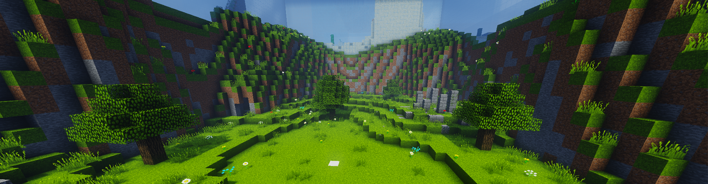

## Das Spielprinzip

Spiele alleine oder im Team gegen deine Gegner in 1vs1. Wähle eigene oder andere Kits und finde in fairen Kämpfen heraus, wer der Bessere ist.
Das Kit lässt sich frei aus allem zusammenstellen, was Creative-Inventar, Amboss und Verzauberungstisch zu bieten haben.
Über den Schwarzhändler können "Hackerkits" erstellt werden, diese beinhalten modifizierte Items.
Arbeite dich in unserem Ranked-System die Karriereleiter hinauf und werde der höchstrangige Spieler des Servers.
Fordere andere Spieler oder Teams heraus oder nimm an einem Turnier teil und beweise dich gegenüber anderen Spielern.

<iframe width="560" height="315" src="https://www.youtube.com/embed/CRG94nn-7C4" frameborder="0" allowfullscreen></iframe>

## Und so gehts
- Im Kit-Bereich kann das eigene Kit erstellt und beliebig oft verändert werden.
- Mit einem Rechtsklick auf die Warteschlange können Kit-Einstellungen und Optionen ausgewählt und verändert werden.
- Per Linksklick mit dem Diamantschwert auf den Warteschlangenzombie kann die Warteschlange betreten werden.
- Mit einem Linksklick auf einen Spieler wird dieser zum Duell herausgefordert, ein Rechtsklick lädt diesen in ein Team ein.
- Erzwinge das Ende eines Kampfes mit `/endmatch`. Mehr Infos dazu findest du [hier](#endmatch).
- Blöcke zerplatzen nach 15 Sekunden in jedem Turnier und Ranked Match, in regulären Spielen, wenn `/endmatch` eingesetzt wurde.
- Ein Klick auf die Ghast-Träne in der Hotbar bietet eine Übersicht über alle Arenen der Lobby
- Mit einem Rechtsklick auf den Kämpfer beobachtest du den Kampf aus seiner Perspektive.
- Der Redstone-Comparator bietet Einstellungsmöglichkeiten zu Warteschlange, Kits, Maps und Kämpfen sowie verschiedene Optionen für die Lobby und den Chat.
- Um noch schneller noch fairere Matches zu finden, kannst du in der globalen Warteschlange gegen Spieler auf allen Servern spielen.
- Sämtliche Kampfstatistiken kannst du mit /statsmenu oder beim Statistiken-Skelett in der Lobby einsehen.

## Ranked System
Arbeite dich in unserem Ranked-System die Karriereleiter hinauf und werde der höchstrangige Spieler des Servers. Insgesamt gibt es 16 Level, die es zu erreichen gilt.
Jeder Spieler besitzt in 1vs1 einen zugewiesenen Wert. Bei einem Sieg gegen deinen Gegner erhöht sich dieser, verlierst du ein Spiel, verringert sich
der Wert. Dein Rang wird aus dem Verhältnis zu anderen Spielern berechnet, die einzelnen Ränge sind dabei nicht ident. So können mehr Spieler einen
niedrigeren Rang besitzen, doch nur die Elite schafft es auf Level 16.
Informationen zu deinem Rang findest du über den Befehl /rankinfo.

| Level | Rang | Item |
| ------ | ------ | ------ |
| 1 | Weiß | Weiß gefärbter Ton |
| 2 | Grau | Hellgrau gefärbter Ton |
| 3 | Türkis | Polierter Diorit |
| 4 | Hellgrün | Hellgrün gefärbter Ton |
| 5 | Blau | Hellblau gefärbter Ton |
| 6 | Gelb | Gelb gefärbter Ton |
| 7 | Dunkelgrau | Polierter Andesit |
| 8 | Grün | Grün gefärbter Ton |
| 9 | Dunkelblau | Blau gefärbter Ton |
| 10 | Orange | Orange gefärbter Ton |
| 11 | Prismarin | Seelaterne |
| 12 | Rot | Rot gefärbter Ton |
| 13 | Schwarz | Schwarz gefärbter Ton |
| 14 | Eisen | Eisenblock |
| 15 | Gold | Goldblock |
| 16 | Diamant | Diamantblock |

### Diamant-Rang
Der Diamant-Rang (Level 16) ist nur für die besten 1vs1-Spieler des Netzwerkes zu erreichen. Die Top 10 des Netzwerkes sind in diesem Level eingerankt, doch auch Spieler mit niedrigeren Rängen
haben die Möglichkeit, in diese Liga einzusteigen. Ist ein Spieler der Top 10 inaktiv, kann ein 11., 12. oder 13. Spieler ebenfalls Level 16 erreichen. Inaktive Spieler des höchsten Level 
können aber nicht immer inaktiv bleiben, wenn sie ihren Rang behalten wollen. Schnell geht es für inaktive Spieler einen Rang hinab, denn nur die Meister im 1vs1 verdienen es, den höchsten 
Rang zu erhalten.

## Winstreaks
Verdiene mit Winstreaks zusätzlich Pixel und kaufe dir mit diesen tolle Items im Pixelshop. Spieler mit [Premium](/ranks/premium/) erhalten mehr Pixel.

| Winstreak | Pixel |
| ------ | ------ |
| 3 Siege | 3 P |
| 6 Siege | 6 P |
| 10 Siege | 10 P |
| 15 Siege | 10 P |
| 20 Siege | 15 P |
| 30 Siege | 30 P | 
| 40 Siege | 30 P |
| 50 Siege | 40 P |
| 60 Siege | 40 P |
| 70 Siege | 40 P |
| 80 Siege | 40 P |
| 90 Siege | 40 P |
| 100 Siege | 50 P |

Nachdem 100 Siege in Folge erreicht wurden steigen die Belohnungen nicht mehr an, man erhält nach je 10 weiteren Siegen dieselbe Belohnung.
Mit dem Befehl `/winstreak` kannst du deine aktuelle Winstreak ansehen. Beachte: Deine Winstreak steigt nur, wenn du über die Warteschlange spielst.

## Freitagsturniere
Jeden Freitag um 20:00 Uhr findet ein großes Timolia-Turnier statt. Dieses lässt sich mit `/join Timolia` von jedem 1vs1-Server betreten.
Das Turnier wird gleichzeitig von einem Streamer live übertragen. Die jeweiligen Streamer und Kits werden auf [Twitter](https://twitter.com/TimoliaTeam) und im [Timolia-Discord](/discord/) angekündigt.
Der Gewinner hat die Möglichkeit, den [MVP-Rang](/ranks/premium/) für einen Monat zu gewinnen. Nimmt er das Risikomatch gegen den Streamer an und gewinnt es, kann er sogar 2 Monate gewinnen. Verliert er allerdings, bekommt er nur einen halben Monat.
Zusätzlich erhält jeder Spieler, der es bis auf den Finalserver schafft, 3 Tage Pro!

## Endmatch
Mit `/endmatch` kann das Ende eines Kampfes erzwungen werden. Sobald dieser Befehl ausgeführt wurde, läuft ein Kampf nur noch eine Minute. Wer in den letzten 30 Sekunden durchschnittlich näher an der Mitte war, gewinnt den Kampf. In einem Turnier lässt sich dieser Befehl natürlich nicht verwenden.
Erst nach einer festgelegten Zeit kann `/endmatch` benutzt werden. Diese ist bei verschiedenen Kits unterschiedlich.  
Hier findest du eine Übersicht der Mindestspielzeiten bis zum Endmatch:

| Kit        | Zeit         |
| ---------- | ------------ |
| 1Bar       | 60 Sekunden  |
| Basic      | 45 Sekunden  |
| NoHitDelay | 60 Sekunden  |
| OP         | 60 Sekunden  |
| PotPVP     | 300 Sekunden |
| Sniper     | 300 Sekunden |
| Soup       | 300 Sekunden |
| Standard   | 45 Sekunden  |
| UHC        | 180 Sekunden |
| SG         | 180 Sekunden |
| Eigene Kits | 30 Sekunden |

## Premium-Features
- Während normale Spieler lediglich ein Kit speichern können, stehen Premium-Spielern je nach Rang bis zu 5 Slots zur Verfügung. Bei der Mapauswahl haben normale User Zugriff auf einen und Premium-Spieler je nach Rang bis auf 5 Slots.
- Des Weiteren können Premium-Spieler Turniere (`/create`) und Teams mit mehr als zwei Spielern erstellen. Einige Ränge können sogar serverweite 1vs1-Turniere starten (`/create`).
- Premium-Spieler können mehr Ranked Matches als normale User am Tag spielen.
- Premium-Spieler erhalten bis zu drei mal mehr Pixel.
- Setze dir im Kitbereich mit `/hat` Items in deiner Hand auf den Kopf.
- Wähle mit `/team setcolor` deine Teamfarbe aus.
- Fordere mit `/bestofx Spieler> <Anzahl>` einen Spieler zu einem Best of 3 oder Best of 5 heraus.
- Werde mit `/togglerank` als normaler Spieler angezeigt.

Welcher Premium-Rang dir welche Vorteile bietet, kannst du [hier](/ranks/premium/) nachlesen.

## Die Befehle

| Befehl | Funktion |
| ------ | -------- |
| `/kit`, `/k`                    | Wählt dein Kit aus |
| `/kit <Name(:1/2/3/4/5)>`       | Wählt das Kit eines anderen Spielers aus |
| `/kits`                         | Listet dir alle von Timolia erstellten Kits auf |
| `/importkit <Zahl>`             | Importiere eines deiner Kits im Kitbereich |
| `/kitinfo`                      | Zeigt Infos über das ausgewählte Kit |
| `/team invite <Name>`           | Lädt einen Spieler in dein Team ein |
| `/team accept <Name>`           | Tritt einem Team bei |
| `/team leave <Name>`            | Zieht eine Teameinladung zurück |
| `/team kick <Name>`             | Kickt einen Spieler aus deinem Team |
| `/challenge <Spieler>`, `/c`    | Fordert einen Spieler zu einem Duell heraus |
| `/leave`, `/l`                  | Verlässt ein Turnier bzw die Warteschlange |
| `/endmatch`                     | Der Kampf wird nach einer Minute mit Entscheidung durch die Mitte beendet |
| `/surrender`                    | Man tötet sich selbst und beendet den Kampf vorzeitig |
| `/spectate <Spieler>`, `/spec`  | Lässt dich den Kampf eines Spielers beobachten |
| `/stats                       ` | Zeigt dir deine Stats an |
| `/stats <Name>`                 | Zeigt dir die Stats eines Spielers an |
| `/statsmenu [Name]`             | Öffnet das Statsmenü |
| `/top <Kit>`                    | Zeigt die Rangliste eines Competitive-Kits an |
| `/winstreak`, `/streak`         | Zeigt deine aktuelle Winstreak |
| `/top <Kit>`                    | Zeigt die Rangliste eines Competitive-Kits an |
| `/join <Name>`                  | Tritt einem Turnier bei |
| `/join <Name> <Passwort>`       | Tritt einem passwortgeschützten Turnier bei |
| `/t`                            | Zeigt die Turnierinformationen |
| `/xp <Level>`                   | Setzt ein XP-Level für dein Kit |
| `/matchinfo`                    | Zeigt Informationen über den aktuellen Kampf |
| `/queue`, `/q`                  | Fügt dich zur Warteschlange hinzu |
| `/compare <Name> <Name>`        | Zeigt die Kampfstatistik zweier Spieler |
| `/settings`                     | Öffnet die Einstellungen |
| `/lastinv <Spieler>`, `/inv`    | Zeigt das letzte Inventar eines Spielers |
| `/liveinv <Spieler>`            | Zeigt das aktuelle Inventar eines Spielers |
| `/ranginfo`                     | Zeigt Informationen zu deinem Rang |
**[Premium](/ranks/premium/) only**:
| `/bestofx <Spieler> <Anzahl>`   | Fordert einen Spieler zu einem Best of 3 oder Best of 5 heraus |
| `/hat`                          | Setzt das Item in deiner Hand als den Helm deines Kits |
| `/create [Passwort]`            | Erstellt ein Turnier (optional mit einem Passwort) |
| `/modify`                       | Bearbeitet die Turniereinstellungen |
| `/start [Zeit]`                 | Startet dein Turnier |
| `/team setcolor`                | Färbt euren Namen entsprechend der gewählten Farbe |

## Arenen und Maps
Selbstgebaute Maps für diesen Modus können <a href="https://forum.timolia.de/forums/map-einsendungen.61/" target="_blank">im Forum eingesendet werden</a>. Mehr dazu erfährst du 
<a href="https://forum.timolia.de/threads/wie-sende-ich-eine-map-ein.21267/" target="_blank">in unserer Anleitung</a>.