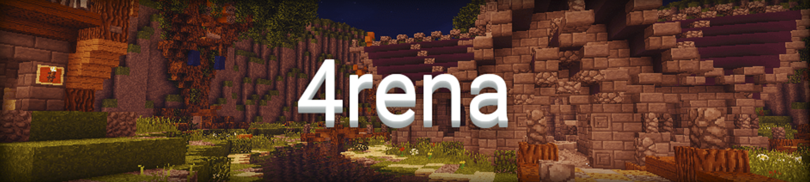

## Das Spielprinzip

4rena verbindet PvP mit taktischen Spielelementen. Beweise dich gegen drei weitere Spieler mit limitierten Items. Wähle jede Runde aus, welches
Equipment dir zur Verfügung steht, bedenke aber: Die Items können nur einmalig verwendet werden!

<iframe width="560" height="315" src="https://www.youtube.com/embed/DTOIOy35JXc" frameborder="0" allowfullscreen></iframe>

## Und so gehts
- Stimme mit `/vote <Map>` für die Arena deiner Wahl.
- Nach dem Ende der Voting-Phase werden alle Spieler in die Arena teleportiert.
- Dir stehen mehrere Kisten mit Items zur Verfügung, diese kannst du jedoch nur einmalig verwenden.
- Drücke auf den Knopf an der Redstonelampe, um das Signal für den Beginn des Kampfes zu geben.
- Alle Spieler werden in die Arena teleportiert, der letzte Überlebende gewinnt die Runde.
- Gewinnt ein Kämpfer insgesamt fünf Runden, hat er das Spiel für sich entschieden.

## Premium-Features
- Pros besitzen zwei, Experts drei Stimmen im Voting-System
- Werde mit `/togglerank` als normaler Spieler angezeigt

## Die Ränge in 4rena

| Rang | Punkte | Name |
| ------ | ------ | ------ |
| 1 | 64 | Camper |
| 2 | 128 | Faustkämpfer |
| 3 | 256 | Schlafmütze |
| 4 | 512 | Holzliebhaber |
| 5 | 1024 | Halbstarker |
| 6 | 2048 | ??? |
| 7 | 4096 | ??? |
| 8 | 8129 | ??? |
| 9 | 16348 | ??? |
| 10 | 32768 | ??? |

Die restlichen Ränge bleiben so lange geheim, bis die entsprechenden Ränge erspielt wurden. Um den Überraschungsfaktor zu bewahren werden namentlich nur die ersten Ränge genannt.

## Arenen und Maps
Selbstgebaute Maps für diesen Modus können <a href="https://forum.timolia.de/forums/map-einsendungen.61/" target="_blank">im Forum eingesendet werden</a>. Mehr dazu erfährst du 
<a href="https://forum.timolia.de/threads/wie-sende-ich-eine-map-ein.21267/" target="_blank">in unserer Anleitung</a>.