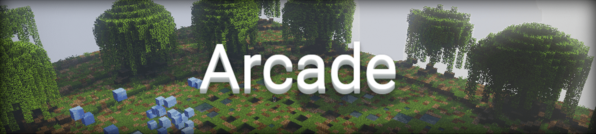

## Das Spielprinzip

Insgesamt zwanzig Minispiele werden in Arcade gespielt, Abwechslung und Spaß sind garantiert. Messe dich einzeln oder in
Turnieren gegen deine Mitspieler und gewinne die meisten Spiele.

<iframe width="560" height="315" src="https://www.youtube.com/embed/hctHaY6g-8A" frameborder="0" allowfullscreen></iframe>

## Und so gehts
- In einer Arcade-Lobby rotieren alle der insgesamt sechzehn Minispiele kontinuierlich.
- Jedes Minispiel benötigt unterschiedliche Fähigkeiten und fordert alle deine Seiten.
- Sowohl in Einzelkämpfen als auch in Turnieren kannst du dich beweisen.

## Die Minispiele

### 1vs1
Ziel dieses Spiels ist es, deine Gegner im Zweikampf zu besiegen. Man kämpft nach und nach gegen einen anderen Spieler, der letzte Überlebende gewinnt das Minispiel.

### Anvil-Crusher
Ziel dieses Spiels ist es, der letzte Überlebende zu sein. Es fallen jede Sekunde mehr Anvils vom Himmel, diesen musst du ausweichen. Tipp: FOV möglichst niedrig einstellen oder Zoom benutzen!

### Bomberman
Ziel des Spieles ist es, als längstes zu überleben. Mit der Tastatur lässt sich der Charakter durch die Map steuern. Blöcke, die euch den weg versperren, können mit TNT gesprengt werden.
Das TNT kann mit der Leertaste gesetzt werden. Auf der Map sind Power-Ups, wie mehrere Bomben, höhere Reichweite und Geschwindigkeit zu finden.

### Clicker
Ziel dieses Spiels ist es, als erster Spieler 64 mal den Knopf an dem Goldblock zu treffen. Der Goldblock wechselt nach jedem Treffer beziehungsweise Verfehlen seine Position.
Das richtige Zielen ist in diesem Spiel sehr wichtig.

### Color Clock
Ziel dieses Spiels ist es, vor Ablauf der Zeit das Farbfeld am Rand der Map zu erreichen, welches in der Mitte der Arena von der Decke fällt.
Wichtig ist es, taktisch zu entscheiden, ob es sich noch lohnt zum nächsten Farbfeld zu laufen, oder ob man lieber direkt zum übernächsten Feld läuft.
Die Reihenfolge der Farben wird in der Mitte durch übereinanderliegende Wollblöcke angezeigt.

### Cube Builder
Ziel dieses Spiels ist es, nach Ablauf der Zeit den größten ausgefüllten Würfel gebaut zu haben, die insgesamt zur Verfügung stehende Zeit wird hierbei im Vorfeld zufällig gewählt.
Die Partikelmarkierung grenzt den Baubereich ein und hilft dir dabei, den Würfel zu bauen. Sind am Ende die Würfel verschiedener Spieler gleich groß, so gewinnt der,
der seinen Würfel am schnellsten vollendet hat. Tipp: Die Partikeleinstellungen sollten auf "Alle" gesetzt sein.

### Electricity
Ziel dieses Spiels ist es, der Elektrizität zu entkommen. Sie fließt durch das Gitter und ist durch eine Glasscheibe gekennzeichnet.
Fließt sie durch dich hindurch, wirst du vom Gitter heruntergestoßen. Der letzte verbleibende Spieler gewinnt dieses Minispiel.

### Fast-Bridging
Ziel dieses Spiels ist es, in einer zufällig generierten Zeit den weitesten Weg zu bauen. Wenn du hinabspringst, hast du für eine kurze Zeit den Blindness-Effekt und kannst
keine Blöcke aufsammeln.

### Gravity
Ziel dieses Spiels ist es, als erster Spieler fünf Punkte zu ergattern. Mit der Schallplatte änderst du deine Gravitation und kannst so vorankommen, der nächste Punkt wird dir im Kompass angezeigt. 
Die fünf farbigen Glasblöcke zeigen dir zusätzlich den nächsten Punkt. Wichtig: Du musst die Punkte in der richtigen Reihenfolge ablaufen.

### Half-Heart-Race
Ziel des Spieles ist es, nach unten zu gelangen - und das nur mit einem halben Herz! Der Erste gewinnt.

### Kabelsalat
Ziel dieses Spiels ist es, als Erster zwei Kabelenden zu verbinden und den Stromzufluss auf 100% zu bringen. Man kann andere Kabel manipulieren, indem man diese mit der Schere durchschneidet. 
Berühren sich zwei stromdurchflossene Kabel explodieren sie, dies kann man durch Verwendung eines isolierten Kabels verhindern.

### Mini-DNA
Ziel dieses Spiels ist es, als erster Spieler die Höhe 16 zu erreichen. Durch Linksklick auf einen Block setzt du einen Checkpoint,
 je mehr Checkpoints du setzt, desto länger dauert das Spawnen neuer Blöcke.
 
### Quiz
Ziel dieses Spiels ist es, die meisten Punkte zu erreichen. Gestellt werden Schätz- und Rechenaufgaben.
 
### Rubik's Cube
Ziel dieses Spiels ist es, die meisten Zauberwürfel innerhalb einer bestimmten Zeit zu lösen.
Ein Zauberwürfel gilt als gelöst, wenn alle Seiten des Würfels jeweils nur ein Farbfeld besitzen.
Den Würfel bewegst du mit Links- und Rechtsklick auf die Farbfelder.
 
### Sammelfieber
Ziel dieses Spiels ist es, nach Ablauf der Zeit am meisten verschiedene Items gesammelt zu haben. Die Welt, in der gespielt wird, ist dabei zufällig generiert und auf 24x24 Chunks begrenzt.
Im Scoreboard wird angezeigt, wie viele verschiedene Items bereits gesammelt wurden, am Ende des Spiels wird das Inventar des Gewinners eingeblendet.
 
### Sumo
Ziel dieses Spiels ist es, möglichst viele Gegner runterzuschlagen. Für jeden Kill bekommt man zwei. Punkte, für jeden Tod einen Punkt abgezogen. Mit dem Boost kannst du dich einmal retten. Der Spieler mit den meisten Punkten gewinnt. 
 
### Tron
Ziel des Spiel ist es, als längstes zu überleben. Die Minecarts der Spieler hinterlassen Spuren aus Glas. Sobald eine gegnerische Spur oder ein Hindernis berührt wird, stirbt man. 
 
### Turmspringen
Ziel dieses Spiels ist es, durch das Treffen von Wasserlöchern die meisten Punkte zu sammeln. Je nach Größe des Wasserlochs bekommt man einen, zwei oder drei Punkte. 
Schafft man den Sprung ins Wasser nicht, verliert man einen Punkt. Das Spiel endet, wenn nach einer bestimmten Zeit niemand mehr im Wasser landet.
 
### Wegweiser
Ziel dieses Spiels ist es, als Erster die gegenüberliegende Seite erreicht zu haben. Um ins Ziel zu kommen muss man den farbigen Glasblöcken folgen. Je länger man wartet,
desto schneller und weiter wird einem der Weg angezeigt. Springt man auf einen falschen Block oder fällt ins Wasser, muss man vom Anfang aus zu seinem Block laufen.
 
### YouTube-Quiz
Ziel dieses Spiels ist es, die meisten Skins von YouTubern in der schnellsmöglichen Zeit zu erraten. Die Skinvorlage muss mit Schneebällen beworfen werden, um die Pixel des Skins sichtbar zu machen.
Der Spieler, der als Erster den Namen errät, bekommt drei Punkte, der Zweitplatzierte erhällt zwei Punkte. Alle weiteren Spieler erhalten beim Erraten jeweils einen Punkt.
Insgesamt werden acht Runden gespielt.
 
## Premium-Features
- Erstelle öffentliche Turniere.
- Premium-Spieler erhalten bis zu drei mal mehr Pixel.
- Favorisiere zwei bzw. drei Spiele.
- Werde mit `/togglerank` als normaler Spieler angezeigt.

Welcher Premium-Rang dir welche Vorteile bietet, kannst du [hier](/ranks/premium/) nachlesen.
 
## Die Befehle
 
| Befehl | Funktion |
| ------ | -------- |
| `/rot` | Zeigt die Spielrotation |
| `/last` | Zeigt die zuletzt gespielten Spiele |
| `/join <Spieler>` | Betrete ein Turnier |
| `/leave` | Verlasse ein Turnier |
**[Premium](/ranks/premium/) only**:
| `/create`          | Erstellt ein öffentliches oder privates Turnier |
| `/invite <Spieler>` | Lädt einen Spieler in dein Turnier ein |
