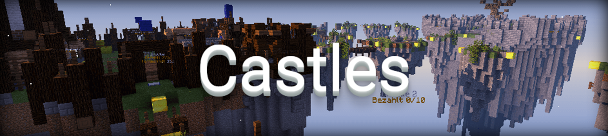

## Der Spielverlauf
Castles ist ein taktisches Spiel in dem du gemeinsam mit deinen Teamkameraden die Flagge deiner Gegner erobern musst. Jedes Team besteht aus maximal 4 Spielern und beginnt das Spiel 
in seiner eigenen Burg.

## Und so gehts
- Ziel des Spiels ist es, die Flagge aus der gegnerischen Burg zu entwenden, zurück in die eigene Basis zu bringen und dann alle gegnerischen Spieler zu töten.
- Mit dem Gold, das du in der Enderchest in deiner Basis und in Kisten auf den anderen Inseln finden kannst, kannst du Strukturen bauen oder Items kaufen.
- In den verschiedenen Shops findest du viele nützliche Items, die es dir ermöglichen die gegnerische Basis taktisch oder schnellstmöglich anzugreifen!
- Solange dein Team über eine Flagge in der eigenen Base verfügt, kannst du beliebig oft respawnen. 
- Sollten alle Flaggen von den Gegnern erobert worden sein, kann man sich nicht wiederbeleben, es sei denn, ein Teammate kann eine Flagge zurückgewinnen.
- Sollte das Spiel lange andauern, weil ein Team sich verbarrikadiert hat, kann durch die Flaggenmacht, also das Besitzen des Großteiles der Flaggen über einen längeren Zeitraum - der Gewinner ermittelt werden. 
- Das Spiel endet, sobald alle gegnerischen Spieler endgültig gestorben sind.

## Punkteverteilung in Castles
- <strong>INFO:</strong> Wenn man die Runde verlässt, bevor das Team ausgeschieden ist, bekommt man <strong>keine</strong> Punkte.
- Die Kills werden am Ende verdoppelt (Kills * 2)
- Die Flaggeneroberungen werden am Ende verachtfacht (Kills * 8)
- Wenn man im Gewinnerteam ist, werden die Punkte am Ende verdoppelt (* 2)
- Wenn man am meisten Kills hat, erhält man +15 Punkte
- Wenn man am zweitmeisten Kills hat, erhält man +10 Punkte
- Wenn man am drittmeisten Kills hat, erhält man +5 Punkte
- Wenn man mehr als 60% des aufgesammelten Goldes in Strukturen investiert hat, erhält man +12 Punkte

## Die Ränge in Castles

| Rang | Punkte | Name |
| ------ | ------ | ------ |
| 1 | 8 | Stalljunge |
| 2 | 16 | Totengräber |
| 3 | 32 | Nachtwächter |
| 4 | 64 | Kämmerer |
| 5 | 128 | Mundschenk |
| 6 | 256 | ??? |
| 7 | 512 | ??? |
| 8 | 1024 | ??? |
| 9 | 2048 | ??? |
| 10 | 4096 | ??? |
| 11 | 8192 | ??? |
| 12 | 16384 | ??? |
| 13 | 32768 | ??? |

Die restlichen Ränge bleiben so lange geheim, bis die entsprechenden Ränge erspielt wurden. Um den Überraschungsfaktor zu bewahren werden namentlich nur die ersten Ränge genannt. 

## Premium-Features
- Pros besitzen zwei, Experts drei Stimmen im Voting-System.
- Werde mit `/togglerank` als normaler Spieler angezeigt

