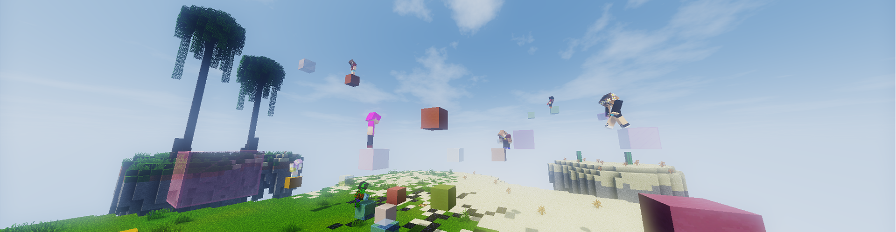

## Das Spielprinzip
Du bist gut in Jump and Runs und möchtest deine Fähigkeiten unter Beweis stellen? Dann ist DNA genau das Richtige für dich! Ziel ist es, als erster Spieler die obere
Grenze von 32 Blöcken zu erreichen.

<iframe width="560" height="315" src="https://www.youtube.com/embed/0xjnQXqb7-A" frameborder="0" allowfullscreen></iframe>

## Und so gehts
- Zu Beginn des Spiels bekommt jeder eine Farbe zugewiesen, diese zeigt die Farbe deines Jump and Runs an.
- Nach ein paar Sekunden spawnen die ersten Blöcke, bei jedem Erklimmen eines Blocks wird ein weiterer gespawnt und der vorherige entfernt.
- Mit Rechtsklick auf einen Block wird ein Checkpoint gesetzt.
- Je mehr Checkpoints gesetzt sind, desto länger dauert es, bis der nächste Block erscheint.
- Blöcke, die die Farbe wechseln, sind Special Blocks. Mit diesen können besondere Items oder Effekte ergattert werden.

## Spezielle Items und Effekte

- <strong>Schneeball</strong>: Schieße deine Gegner nach unten
- <strong>Faules Ei</strong>: Verursache Übelkeit bei deinem Gegner
- <strong>Speed</strong>: Springe durch den Speed-Effekt schneller und weiter
- <strong>JumpBoost</strong>: Springe durch den Jump-Boost schneller und weiter

## Die Ränge in DNA

| Rang | Punkte | Name |
| ------ | ------ | ------ |
| 1 | 64 | Tastenklopper |
| 2 | 128 | Hindernis |
| 3 | 256 | Bergziege |
| 4 | 512 | Gegner |
| 5 | 1024 | Sprinter |
| 6 | 2048 | ??? |
| 7 | 4096 | ??? |
| 8 | 8129 | ??? |
| 9 | 16348 | ??? |
| 10 | 32768 | ??? |

Die restlichen Ränge bleiben so lange geheim, bis die entsprechenden Ränge erspielt wurden. Um den Überraschungsfaktor zu bewahren werden namentlich nur die ersten Ränge genannt.

## Premium-Features

- Pros besitzen zwei, Experts drei Stimmen im Voting-System
- Werde mit `/togglerank` als normaler Spieler angezeigt

## Arenen und Maps
Selbstgebaute Maps für diesen Modus können <a href="https://forum.timolia.de/forums/map-einsendungen.61/" target="_blank">im Forum eingesendet werden</a>. Mehr dazu erfährst du 
<a href="https://forum.timolia.de/threads/wie-sende-ich-eine-map-ein.21267/" target="_blank">in unserer Anleitung</a>.