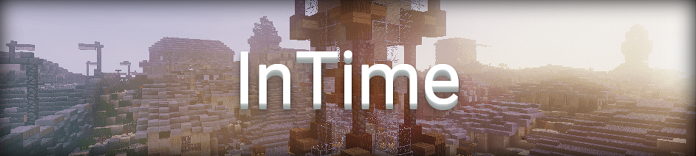

## Das Spielprinzip
"Zeit ist Geld" - dieses Sprichwort beschreibt InTime mehr als alles andere. Waffen, Rüstung, Nahrung, Potions und spezielle Items kosten Zeit, Lebenszeit.
Wenn deine eigene Zeit abgelaufen ist stirbst du, deshalb ist es wichtig, mit der eigenen Zeit achtsam umzugehen.

## Und so gehts
- Alle Spieler erhalten zu Beginn des Spiels ihre Lebenszeit, diese läuft bei Aktivierung des Time-Keepers ab.
- In der Mapmitte und auf der Welt verteilt spawnen Villager, die unterschiedlichste Items handeln, die Art der Items kann man über den Köpfen der Villager erkennen.
- Am Spawn werden nach einiger Zeit neue Villager gespawnt, diese handeln neue Items.
- Wenn deine Zeit abgelaufen ist stirbst du, doch natürlich ist es auch möglich Zeit hinzuzubekommen.
- Schlägst du einen Gegner mit der Uhr, ziehst du ihm kostbare Lebenszeit ab und transferierst diese auf dich selbst.
- Nach einiger Zeit erhält man in der Mitte der Map Lebenszeit, sofern man sich dort alleine aufhält.
- Stirbt ein Spieler, wird die Restzeit, die der Spieler noch besaß, gleichmäßig auf alle verbleibenden Kämpfer verteilt.

## Die Ränge in InTime

| Rang | Punkte | Name |
| ------ | ------ | ------ |
| 1 | 64 | Zeitverschwender |
| 2 | 128 | Trödler |
| 3 | 256 | Sekundenzähler |
| 4 | 512 | Minute-Man |
| 5 | 1024 | Mann der Stunde |
| 6 | 2048 | ??? |
| 7 | 4096 | ??? |
| 8 | 8129 | ??? |
| 9 | 16348 | ??? |

Die restlichen Ränge bleiben so lange geheim, bis die entsprechenden Ränge erspielt wurden. Um den Überraschungsfaktor zu bewahren werden namentlich nur die ersten Ränge genannt.

## Spezielle Items
- <strong>Zeitspeicher</strong>: Wenn man einen Zeitspeicher rechtsklickt, bekommt man zwischen 90 und 190 Prozent des Kaufpreises an Zeit wieder zurück.
- <strong>Timekeeper</strong>: Wenn man einen Timekeeper rechtsklickt, wird die Schutzphase beendet
- <strong>Uhr</strong>: Wenn man einen Gegner mit der Uhr schlägt, klaut man diesem seine Lebenszeit. Bei einem normalen Schlag werden zehn, bei einem Critical Hit fünfzehn Sekunden übertragen.
- <strong>Kompass</strong>: Der Kompass führt dich zu deinem nächsten Gegner

## Premium-Features
- Premium-Spieler besitzen je nach Rang bis zu vier Stimmen im Voting-System.
- Premium-Spieler erhalten bis zu drei mal mehr Pixel.
- Werde mit `/togglerank` als normaler Spieler angezeigt.

Welcher Premium-Rang dir welche Vorteile bietet, kannst du [hier](/ranks/premium/) nachlesen.