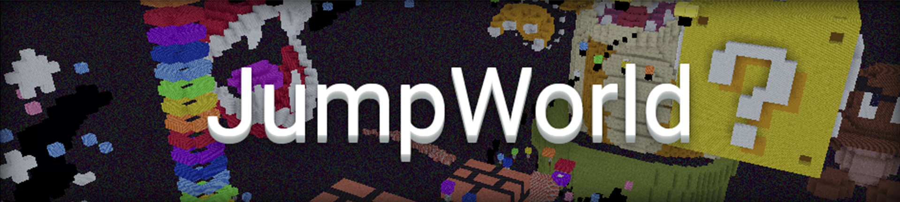

## Das Spielprinzip
In JumpWorld können verschiedenste Jump and Runs gespielt, aber auch selbst erbaut werden. Des weiteren kann man sich mit Freunden in Duellen messen. Täglich wird ein
Jump and Run des Tages gekürt, dies ist der bestbewertetste Parcour des vorherigen Tages.

## Und so gehts
- Mit der Rakete in deinem Inventar können Jump and Runs gesucht werden.
- Solltest du ein bestimmtes Jump and Run spielen wollen nutze den Befehl `/enter <ID>`.
- Mit `/duel invite <Spieler>` oder mit einem Linksklick mit dem Schwert forderst du einen Spieler zu einem Duell heraus.
- Das Jump and Run des Tages erreichst du über das Portal in der JumpWorld-Lobby.
- Das Ziel jedes Parcours ist eine goldene Druckpltte, eiserne Druckplatten sind Checkpoints.
- Wenn du ein Jump and Run betrittst befinden sich mehrere Items in deinem Inventar. Mit dem roten Farbstoff wirst du zum letzten Checkpoint zurück teleportiert.
- Mit dem zweiten Item in deinem Inventar kannst du die Sichtbarkeit der Spieler einstellen.
- Am Ende eines Jump and Runs kannst du den Parcour in insgesamt drei Kategorien bewerten.
- Solltest du ein Jump and Run begutachten wollen kannst du mit `/spec` den Flugmodus aktivieren.

## Der Bau-Modus
- Mit dem Feuerwerksstern in deinem Inventar kannst du einen Bauslot auswählen, sofern andere Spieler mitbauen sollen musst du diese zuvor in ein Duell einladen.
- Du kannst zwischen verschiedenen Standard-Welten wählen oder in einem Void deine eigene Welt kreieren.
- Mit `/b` kannst du dir Specialblöcke geben lassen, Portale und Effektdruckplatten kannst du mit einem Rechtsklick bearbeiten.
- Mit `/setstart` kannst du den Startpunkt deines Parcours festlegen, mit `/setblock` kannst du unter dir einen Block setzen.
- Um dein Jump and Run veröffentlichen zu können musst du dieses vorher ein Mal selbst geschafft haben. Wähle dazu im jeweiligen Bauslot "JnR durchlaufen" aus.
- Im Baumenü kannst du deinem Parcour einen Namen geben.

## Premium-Features
- Zwei Bauslots für Pros, drei Bauslots für Experts
- Armorstands und Spielerköpfe beim Bauen von Jump and Runs

## Befehle

| Befehl | Funktion |
| ------ | -------- |
| `/enter <ID>`, `/e` | Betrete einen bestimmtes Jump 'n Run |
| `/editparcour`, `/edit [Slot]`| Editiert das Jump 'n Run auf einem bestimmten Slot |
| `/saveparcour` | Speichert dein aktuelles Jump 'n Run |
| `/leave`, `/l` | Verlässt das aktuelle Jump 'n Run |
| `/setstart` | Setzt den Startpunkt deines Jump 'n Runs |
| `/setend` | Setzt den Endpunkt deines Jump 'n Runs |
| `/checkpoint`, `/fall`, `/kill` | Teleportiert dich zurück zum letzten Checkpoint |
| `/duel <Spieler>` | Lädt einen Spieler in ein Duell ein |
| `/duel accept <Spieler>` | Nimmt die Einladung in ein Duell an |
| `/duel leave <Spieler>` | Verlässt ein Duell |
| `/setblock` | Platziert den Block in deiner Hand unter dir |
| `/jump` | Lässt dich dein Jump'n'Run testen |
| `/b` | Öffnet das Bau-Info-Menü |
| `/join <Name>` | Betritt das Jump'n'Run, auf dem sich [Spieler] gerade befindet |
| `/top <ID>` | Zeigt die Top-Zeiten des Jump'n'Runs mit der ID [id] an |
| `/top <ID> -f` | Zeigt die schlechtesten Zeiten für ein Jump'n'Run an |