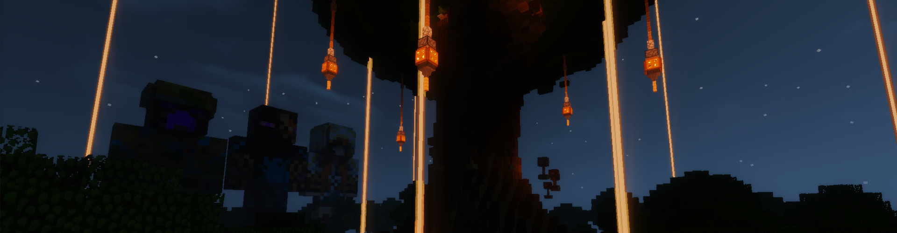

## Der Spielverlauf
Willkommen bei den Timolianischen Spielen! Hier kannst du deine PvP-Skills im Kampf gegen 23 andere Spieler beweisen. In einer unendlich großen Welt findest du
überall Beacons, die Items ausspucken, sobald du dich ihnen näherst, welche jedoch schon bald wieder verschwinden.

## Und so gehts
- Alle Kämpfer spawnen in einer unendlich großen zufällig generierten Welt.
- In dieser Welt spawnen Beacons, diese spucken zufällige Items aus.
- Stellst du dich auf einen der Beacon während dieser verschwindet teleportierst du dich in die Nähe eines Gegners, eine Partikel-Spur zeigt dir den direkten Weg.
- Entscheide selbst, wann du dich bereit für den Kampf fühlst. Aber Vorsicht! Es kann sich auch jederzeit jemand zu dir teleportieren.

## Premium-Features
- Werde mit `/togglerank` als normaler Spieler angezeigt