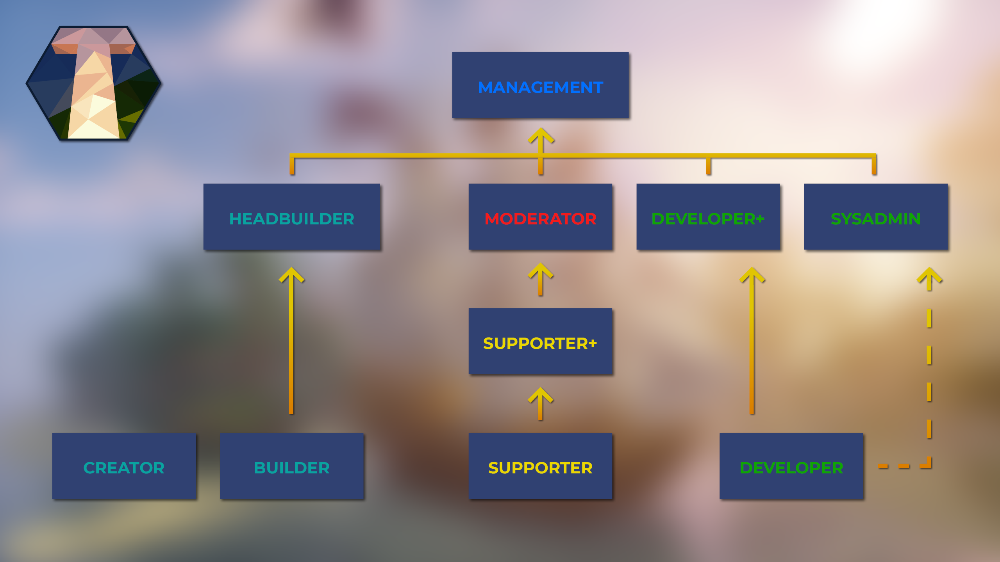

Das Timolia-Team besteht aktuell aus 47 Mitgliedern und ist in die Ränge 
Management, 
SysAdmin, 
Developer+, 
Developer, 
Moderator, 
Supporter+, 
Supporter, 
HeadBuilder, 
Builder und 
Creator 
aufgeteilt.

Nachfolgend findet ihr eine Liste aller Teammitglieder von Timolia und deren Aufgabenbereichen.
 

## Management

Diese Teamler bilden die Leitung Timolias. Sie kümmern sich um die Verwaltung, Organisation und die Teamleitung.

### <strong>Lascona</strong>
- <u>Rang (ingame):</u> Management
- <u>Hauptverantwortlich:</u> Teammanagement, Projektleitung, Internes und externes Feedback, YouTuber

### <strong>MCExpertDE</strong>
- <u>Rang (ingame):</u> Management
- <u>Hauptverantwortlich:</u> Geschäftsführung, Verwaltung
- <u>Nebenverantwortlich:</u> Timolia Plugins, Hardware

### <strong>xiantiel</strong>
- <u>Rang (ingame):</u> Management
- <u>Hauptverantwortlich:</u> Technische Leitung, Projektleitung und -verwaltung, Systemadministration, DevOps
- <u>Nebenverantwortlich:</u> Timolia-Plugins

## SysAdmin

Systemadministratoren planen, installieren, konfigurieren und warten die technischen Systeme Timolias. 
Sie führen Updates durch und sorgen für ein reibungsloses Spielerlebnis im Alltag.

### <strong>Caelis</strong>
- <u>Rang (ingame):</u> SysAdmin
- <u>Hauptverantwortlich:</u> Systemadministration, Interne Webanwendung, Technische Leitung des Bauteams, Timolia-Plugins

### <strong>Docmac</strong>
- <u>Rang (ingame):</u> SysAdmin
- <u>Hauptverantwortlich:</u> Systemadministration

### <strong>physanus</strong>
- <u>Rang (ingame):</u> SysAdmin
- <u>Hauptverantwortlich:</u> Timolia HowTo
- <u>Nebenverantwortlich:</u> Bauteam-Twitter, Broadcasts, TeamSpeak, Timolia Turnier Organisation, Twitter

### <strong>zortax</strong>
- <u>Rang (ingame):</u> SysAdmin
- <u>Hauptverantwortlich:</u> Systemadministration, DevOps

## Developer+

Sie verfügen über langjährige Erfahrung als Entwickler auf Timolia und stehen bei internen Fragen zum Development zur Verfügung. 
Auch kümmern sie sich um Timolia Plugins, entwickeln neue Features und Spielmodi und beheben mögliche Spielfehler.

### <strong>svdragster</strong>
- <u>Rang (ingame):</u> Developer+
- <u>Hauptverantwortlich:</u> Anti-Cheat, Timolia-Plugins
- <u>Nebenverantwortlich:</u> Feedback Forum, Fragen und Antworten Forum, Map-Einsendungen

### <strong>MCelements</strong>
- <u>Rang (ingame):</u> Developer+
- <u>Hauptverantwortlich:</u> TeamSpeak, Timolia-Plugins, Organisation und Betreuung neuer Developer
- <u>Nebenverantwortlich:</u> Systemadministration, Verschicken von Reddit-Hundeposts

### <strong>tr7zw</strong>
- <u>Rang (ingame):</u> Developer+

## Developer

Developer kümmern sich um die Timolia Plugins, entwickeln neue Features und Spielmodi und kümmern sich um die Bugs, pardon, Features auf Timolia.

### <strong>\_ELKMAN\_</strong>
- <u>Rang (ingame):</u> Developer

### <strong>\_TakeItEaZy\_</strong>
- <u>Rang (ingame):</u> Developer

### <strong>Flycofx</strong>
- <u>Rang (ingame):</u> Developer
- <u>Hauptverantwortlich:</u> Chainreact, Weihnachts - Timolia Adventure

### <strong>Handis</strong>
- <u>Rang (ingame):</u> Developer

### <strong>play4me_</strong>
- <u>Rang (ingame):</u> Developer
- <u>Nebenverantwortlich:</u> Web-Development

### <strong>Raziel</strong>
- <u>Rang (ingame):</u> Developer
- <u>Hauptverantwortlich:</u> Anti-Cheat

### <strong>TimderBusfahrer</strong>
- <u>Rang (ingame):</u> Developer

### <strong>Vuquiz</strong>
- <u>Rang (ingame):</u> Developer

### <strong>YTKacperSKY</strong>
- <u>Rang (ingame):</u> Developer

## Moderator

Moderatoren sind langjährige und besonders erfahrene Teamler, die einzigartige Expertise in ihrem jeweiligen Fachgebiet aufweisen. 
Sie dienen als interne Ansprechpartner bei Fragen und koordinieren häufig einzelne Aufgabengebiete.

### <strong>BowspamExpertDE</strong>
- <u>Rang (ingame):</u> Moderator
- <u>Hauptverantwortlich:</u> Map-Einsendungen, Zu Unrecht gebannt Forum
- <u>Nebenverantwortlich:</u> Spieler melden Forum, YouTuber-Ränge

### <strong>ferdedelino</strong>
- <u>Rang (ingame):</u> Moderator
- <u>Hauptverantwortlich:</u> Supporterauswahl
- <u>Nebenverantwortlich:</u> Community-Discord, Timolia Turnier Organisation, Zu Unrecht gebannt Forum

### <strong>medicoo</strong>
- <u>Rang (ingame):</u> Moderator
- <u>Hauptverantwortlich:</u> Bauteam-Twitter, Timolia Turnier Organisation, YouTuber-Ränge
- <u>Nebenverantwortlich:</u> TeamSpeak

### <strong>NameIsTaken</strong>
- <u>Rang (ingame):</u> Moderator

## Supporter+

Sie verfügen über ein umfassendes Fachwissen und stehen für alle Fragen und Reports zur Verfügung. 
Sie sind die ersten, an die sich Spieler mit ihren Anliegen wenden können.

### <strong>CoveredSymmetry</strong>
- <u>Rang (ingame):</u> Supporter+
- <u>Hauptverantwortlich:</u> Anregungen und Vorschläge Forum, Broadcasts, Forenorganisation, Fragen und Antworten Forum
- <u>Nebenverantwortlich:</u> Entschuldigungen

### <strong>Marmeladenprofi</strong>
- <u>Rang (ingame):</u> Supporter+
- <u>Nebenverantwortlich:</u> Entschuldigungen, Map-Einsendungen, Zu Unrecht gebannt Forum

### <strong>RodspamExpertRU</strong>
- <u>Rang (ingame):</u> Supporter+
- <u>Hauptverantwortlich:</u> Baufehlerbehebung, Entschuldigungen
- <u>Nebenverantwortlich:</u> Anregungen und Vorschläge Forum, Broadcasts, Fragen und Antworten Forum, Map-Einsendungen

## Supporter

Supporter stehen für alle grundlegenden Fragen und Reports zur Verfügung und sind die ersten, an die sich Spieler mit ihren Anliegen wenden können.

### <strong>\_Tetzel\_</strong>
- <u>Rang (ingame):</u> Supporter
- <u>Nebenverantwortlich:</u> Broadcasts

### <strong>byRoadrunner</strong>
- <u>Rang (ingame):</u> Supporter

### <strong>Chrissi1505</strong>
- <u>Rang (ingame):</u> Supporter
- <u>Nebenverantwortlich:</u> Community-Discord, Entschuldigungen, Twitter

### <strong>einMole</strong>
- <u>Rang (ingame):</u> Supporter

### <strong>NetflixGutschein</strong>
- <u>Rang (ingame):</u> Supporterin

### <strong>Pexa</strong>
- <u>Rang (ingame):</u> Supporter

### <strong>Semolius</strong>
- <u>Rang (ingame):</u> Supporter

### <strong>Stracy</strong>
- <u>Rang (ingame):</u> Supporter

### <strong>TherapieWolf</strong>
- <u>Rang (ingame):</u> Supporter

### <strong>TrueSpoki</strong>
- <u>Rang (ingame):</u> Supporter

### <strong>Wie\_Shu</strong>
- <u>Rang (ingame):</u> Supporter

### <strong>xTessia</strong>
- <u>Rang (ingame):</u> Supporterin
- <u>Nebenverantwortlich:</u> Broadcasts, Entschuldigungen, TeamSpeak, Twitter, YouTuber-Ränge

## HeadBuilder

Sie leiten und organisieren das Bauteam und dienen als erste Ansprechpartner für alle Builder. 
Außerdem kümmern sie sich um die Auswahl und Einarbeitung neuer Builder und sind die Schnittstelle 
zwischen dem Bauteam und der allgemeinen Projektorganisation.

### <strong>JukPlays</strong>
- <u>Rang (ingame):</u> HeadBuilder
- <u>Hauptverantwortlich:</u> Bauteam-Twitter, Management des Bauteams

## Builder

Das Bauteam kreiert neue Maps und Lobbys für alle Gelegenheiten und Spielmodi auf Timolia. 
Sie betreuen die architektonische Gestaltung neuer Modi und betreuen externe Mapeinsendungen.

### <strong>12Build</strong>
- <u>Rang (ingame):</u> Builder

### <strong>crelias</strong>
- <u>Rang (ingame):</u> Builder

### <strong>Dankbarkeit</strong>
- <u>Rang (ingame):</u> Builder

### <strong>DiddiHD</strong>
- <u>Rang (ingame):</u> Builder

### <strong>Sentuqs</strong>
- <u>Rang (ingame):</u> Builder

### <strong>TraizzyBuilds</strong>
- <u>Rang (ingame):</u> Builder

## Creator

Als kreative Ader sind sie für die verschiedensten Belange von Grafikdesign bis Übersetzung zuständig.

### <strong>Evageddon</strong>
- <u>Rang (ingame):</u> Creator
- <u>Hauptverantwortlich:</u> Grafikdesign

### <strong>Niizck</strong>
- <u>Rang (ingame):</u> Creator
